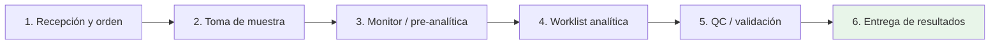
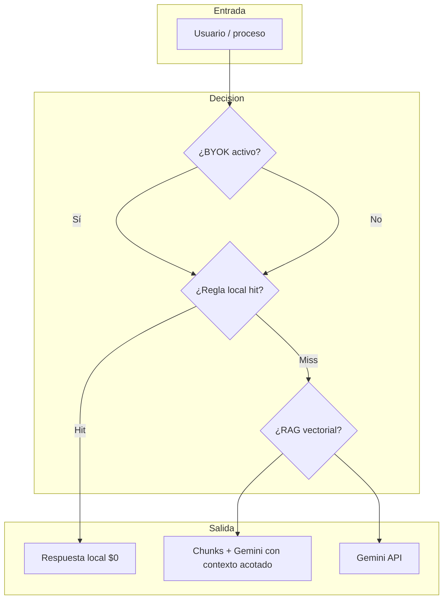
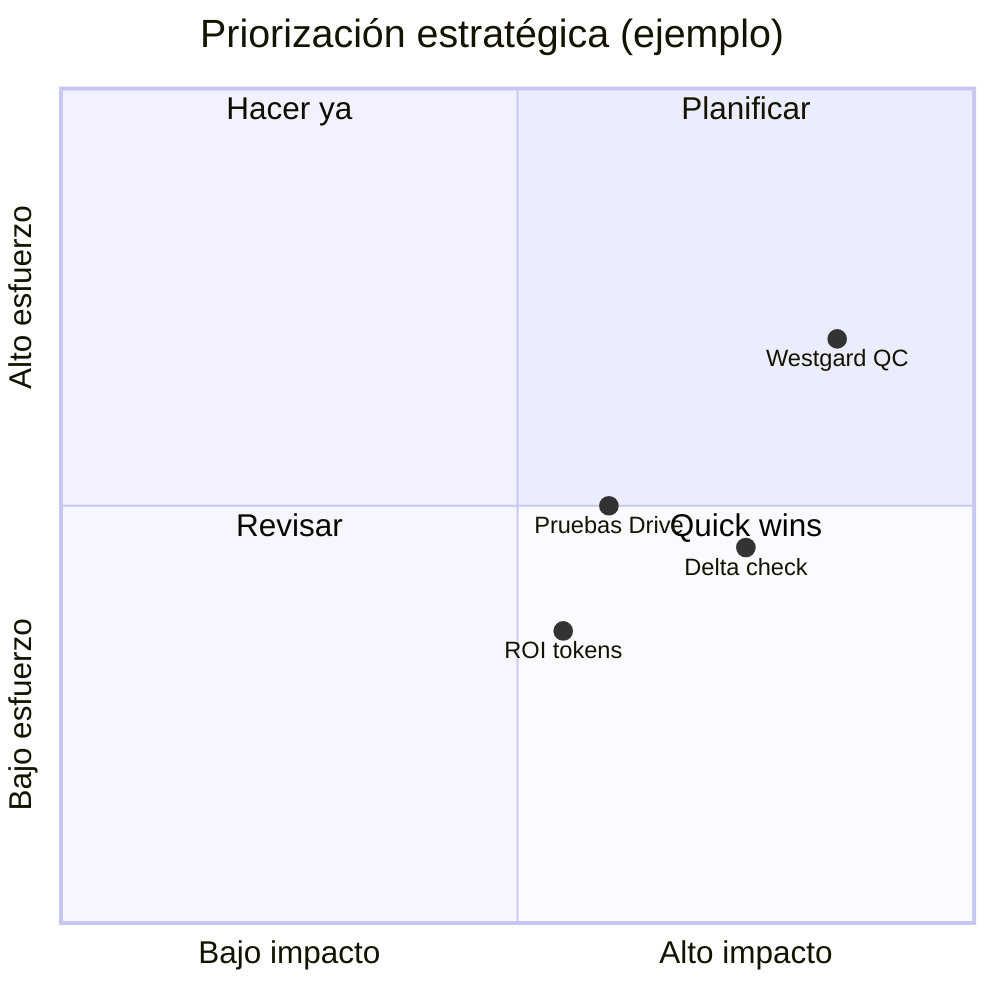

# PRISLAB Master Document v1.0

**Documento de referencia técnica y estratégica**  
**Versión:** 1.0 · **Fecha de referencia:** marzo 2026  
**Clasificación:** Uso interno — Dirección, Arquitectura y Control de Calidad

---

## Tabla de contenidos

1. [Filosofía y origen (el porqué)](#1-filosofía-y-origen-el-porqué)
2. [Arquitectura técnica y gobernanza (lo que ya es real)](#2-arquitectura-técnica-y-gobernanza-lo-que-ya-es-real)
3. [Estructura operativa y legal](#3-estructura-operativa-y-legal)
4. [Módulos integrados (estado actual)](#4-módulos-integrados-estado-actual)
5. [Apéndice: hoja de ruta y pendientes](#5-apéndice-hoja-de-ruta-y-pendientes)
6. [Glosario técnico](#6-glosario-técnico)

---

## 1. Filosofía y origen (el porqué)

### 1.1 Nacimiento desde la trinchera clínica

**PRISLAB** (identidad operativa: *Primero Salud Laboratorio*) no nació como un prototipo de laboratorio genérico, sino como respuesta a la tensión real entre **velocidad operativa**, **calidad diagnóstica** y **sostenibilidad económica** en un laboratorio clínico que opera bajo exigencias de **COFEPRIS**, buenas prácticas de calidad y expectativas de pacientes y médicos.

El ADN del proyecto se articula en tres ejes:

| Eje | Significado |
|-----|-------------|
| **Clínica primero** | Los flujos siguen el camino biológico de la muestra (no el del software por conveniencia). |
| **Humano en el último clic** | La IA (PRIS) actúa como copiloto: sugiere, transcribe, recupera contexto; la validación y la responsabilidad legal permanecen en personal autorizado. |
| **Rentabilidad sin cinismo** | La automatización y el *Cost Shield* de IA existen para **reducir fricción y costo variable**, no para sustituir el juicio clínico ni el cumplimiento normativo. |

### 1.2 Misión declarada

> **Elevar la calidad diagnóstica y la trazabilidad operativa mediante IA asistida y multi-tenant, sin sacrificar la rentabilidad del laboratorio**, priorizando precisión clínica, cumplimiento regulatorio (COFEPRIS / NOM aplicables) y experiencia del paciente y del personal.

### 1.3 Principios no negociables

- **Aislamiento de datos por tenant** (empresa): ningún cruce de información entre laboratorios clientes.
- **Entrega de resultados médicos condicionada al cumplimiento financiero** donde exista saldo pendiente (*candado financiero* omnicanal).
- **Biblioteca RAG como fuente de verdad** para sugerencias basadas en manuales internos (ej. Bethesda Hematología), antes que conocimiento general no auditado.

---

## 2. Arquitectura técnica y gobernanza (lo que ya es real)

### 2.1 Flujo biológico: el “túnel de producción” (6 pasos)

El sistema modela la operación como una **línea de producción clínica** alineada con pre-analítica, analítica y post-analítica:

| Paso | Nombre operativo | Rol del sistema |
|------|------------------|-----------------|
| **1** | Recepción | Registro de paciente, estudios, cobro (con reglas de abono/CxC donde aplique), generación de orden. |
| **2** | Toma de muestra | Consola de cubículo, checklist, audio/PRIS según configuración, cambio de estados de muestra. |
| **3** | Monitor | Visibilidad de pendientes, urgencias y cuellos de botella pre-analíticos. |
| **4** | Worklist analítica | Captura densa tipo consola industrial, navegación por teclado, delta check, semáforo de pánico. |
| **5** | QC / validación | Validación por perfil autorizado, candado financiero en **entrega** (no bloquea trabajo interno). |
| **6** | Entrega | PDF, WhatsApp, portal, QR — todas sujetas al *candado financiero* si hay saldo. |

> **Nota de implementación:** En la interfaz, la navegación lateral del laboratorio se organizó en **Operación diaria → Archivo y consulta → Gestión**, para que el flujo visual coincida con el flujo biológico.

### 2.2 Estrategia de eficiencia de IA (*Cost Shield*)

El objetivo es **minimizar costo recurrente de tokens** sin degradar la utilidad clínica.

| Mecanismo | Descripción | Ubicación conceptual |
|-----------|-------------|------------------------|
| **BYOK** (*Bring Your Own Key*) | Cada tenant puede configurar su propia API Key de Gemini (cifrada con Fernet). Si existe, el costo de API lo asume el laboratorio cliente. | Modelo `Empresa`: `byok_gemini_api_key_enc`; helpers `set_byok_gemini_key` / `get_byok_gemini_key`; cliente en `core.utils.ia_resources.get_gemini_client_para_empresa`. |
| **Key maestra PRISLAB** | Si no hay BYOK, se usa la clave de plataforma y el consumo se asocia al tenant para cuotas y auditoría. | `UsoRecursosIA.fuente_key` = `MASTER`. |
| **Caché de reglas locales** | Reglas aprobadas por el QFB almacenadas para respuestas repetibles a **costo $0** en consultas posteriores. | Modelo `ReglaLocalIA`; utilidades en `core.utils.ia_cache`. |
| **Telemetría de uso** | Registro por empresa, fecha, tipo de proceso, tokens y latencia. | Modelo `UsoRecursosIA` (tipos: NLP toma, RAG, OCR, worklist, QC, etc.). |
| **NLP híbrido** | Transcripción/NLP en navegador donde aplique; envío al LLM solo de texto filtrado o contexto RAG, reduciendo tokens. | Política de producto; implementación distribuida en vistas PRIS/toma de muestra. |

### 2.3 Almacenamiento descentralizado (BYOD)

| Concepto | Implementación |
|----------|----------------|
| **BYOD** | Google Drive **por tenant**: carpeta raíz (`drive_folder_id`) y credenciales en JSON cifrado (`drive_client_config_enc`). |
| **Cifrado** | Campos sensibles cifrados con **Fernet** (`FERNET_KEY` en entorno). |
| **Integridad** | Donde aplique el flujo de archivos críticos, se persiste **hash SHA-256** para trazabilidad forense (política documentada en entrega de medios). |
| **Separación** | El “motor” puede permanecer en nube (p. ej. Cloud Run); el almacenamiento pesado se orienta al Drive del cliente para costo y soberanía de datos. |

### 2.4 Biblioteca de inteligencia RAG

| Componente | Descripción |
|------------|-------------|
| **DocumentoCapacitacion** | Manuales PDF (ej. Bethesda 4.ª ed.) con metadatos: módulo, tipo, **estado RAG** (subido / procesando / entrenado / error), **chunks** indexados, validador sanitario. |
| **Ingesta** | Extracción de texto por página (`pypdf`), fragmentación, embeddings (p. ej. `text-embedding-004`), persistencia en **ChromaDB** o fallback **SQLite** local en `rag_store/`. |
| **Consulta** | `consultar_cerebro` en `core.utils.rag_engine`: recuperación top-k + generación con contexto acotado (Gemini). |
| **Worklist** | Botón “Manuales” en captura industrial: consulta contextual con valores capturados vía API dedicada. |

### 2.5 Candado financiero (entrega)

Regla única centralizada en `core.utils.candado_financiero`:

- Recepción puede confirmar órdenes **con saldo**.
- Laboratorio puede **procesar y validar** internamente.
- **Ninguna** salida de resultados al paciente (PDF, WhatsApp, email, portal, QR) si `saldo > 0` (mensaje institucional unificado).

---

## 3. Estructura operativa y legal

### 3.1 Jerarquía profesional (gobernanza)

| Rol | Responsabilidad |
|-----|-----------------|
| **Dirección / Director QC — Químico Clínico** | Jonathan Alonso Samos Sánchez: visión de producto, priorización clínica, aprobación de biblioteca RAG y políticas de calidad. |
| **Responsable Sanitaria — QC Química Clínica** | Giselle Margarita López Gutiérrez: validación sanitaria y firma institucional en documentación de resultados; datos COFEPRIS/cédula según configuración en documentos y PDF. |
| **Personal operativo** | Químicos, técnicos, recepción, farmacia: actúan dentro de permisos; la IA no sustituye firmas ni responsabilidad legal. |

### 3.2 Cumplimiento

- Marco referencial: **COFEPRIS**, NOM aplicables al sector, buenas prácticas de laboratorio (**ISO 15189** como referencia de gestión de calidad).
- Trazabilidad: logs de uso de IA, auditoría de entregas, bitácoras donde el producto las implementa.

---

## 4. Módulos integrados (estado actual)

Visión **por capacidad**, no solo por nombre de app Django.

| Área | Funciones principales | Estado (alto nivel) |
|------|------------------------|---------------------|
| **Core / multi-tenant** | Empresa, sucursal, usuarios, feature flags por módulo, aislamiento de consultas | Operativo |
| **Recepción laboratorio** | Orden, estudios, pagos, candado en confirmación según reglas de negocio, campos críticos | Operativo; evolución continua UI/UX |
| **Toma de muestra** | Dashboard, preparación, checklist, transición de estados | Operativo |
| **LIMS / Worklist** | `captura_resultados_industrial`: tabla densa, delta, pánico, manuales RAG | Operativo |
| **Biblioteca RAG** | `/capacitacion/rag/`: subida, semáforo, chat, worklist API | Operativo (v1 RAG) |
| **Farmacia** | PDV, kardex, silo intocable por diseño | Operativo |
| **Inventario federado** | Silos Lab / Consultorio / Generales + motor de compras (según fase desplegada) | Según despliegue |
| **CMMS** | Mantenimiento, tickets, wizard de protocolos | Según despliegue |
| **Finanzas / War Room** | KPIs, anomalías (según configuración) | Operativo parcial |
| **Bienestar staff** | Aislado de datos de pacientes (NOM-035) | Operativo con privacidad reforzada |
| **Portal paciente** | Descarga/consulta sujeta a candado financiero | Operativo con reglas de sesión |

---

## 5. Apéndice: hoja de ruta y pendientes

Lista técnica priorizable (no exhaustiva del código; sí de intención de producto acordada):

| # | Ítem | Tipo | Notas |
|---|------|------|-------|
| 1 | **Delta check automático** en todos los parámetros y estudios | Producto + datos | Unificar fuente de “último resultado” por paciente+parámetro; manejar ausencia de historial. |
| 2 | **QC avanzado — Westgard** | LIMS | Reglas automatizadas, gráficos Levey-Jennings, vínculo a tickets CMMS cuando falle QC. |
| 3 | **Cobranza pendiente en Paso 6** | Finanzas + UX | Panel claro de saldo, convenios y motivos; integración con candado ya existente en entrega. |
| 4 | **ROI de tokens ahorrados** (caché local vs API) | Analytics | Agregados desde `UsoRecursosIA` + hits en `ReglaLocalIA`; dashboard Director. |
| 5 | **Pruebas de carga** Drive / archivos cifrados | DevOps | Latencia, reintentos, límites de cuota Google; modo degradado documentado. |
| 6 | **HL7 / ASTM** equipos | Integración | Modo standby hasta manuales de fabricante; logging sin silenciar errores. |
| 7 | **Homologación** de seeds de parámetros vs catálogo maestro | Datos | Evitar divergencia `core` vs `laboratorio` legacy. |
| 8 | **Seguridad** | CISO | 2FA selectivo, rotación de secretos, pentest periódico. |

### 5.1 Diagrama de madurez (referencia)

---

## 6. Glosario técnico

| Término | Definición |
|---------|------------|
| **Tenant** | Empresa cliente del SaaS; todos los datos deben filtrarse por `empresa`. |
| **BYOK** | API Key propia del cliente para Gemini. |
| **BYOD** | Google Drive propio del cliente para medios y respaldos. |
| **RAG** | *Retrieval Augmented Generation*: recuperación de fragmentos + generación con contexto. |
| **Candado financiero** | Bloqueo de **entrega** de resultados si hay saldo pendiente. |
| **Cost Shield** | Conjunto de políticas para limitar costo de IA (BYOK, caché, RAG local). |

---

## Control de documento

| Campo | Valor |
|-------|--------|
| **Documento** | PRISLAB Master Document |
| **Versión** | 1.0 |
| **Autoría** | Arquitectura PRISLAB (síntesis código + conversaciones de proyecto) |
| **Próxima revisión** | Tras hitos mayores: multi-tenant completo, RAG v2, QC Westgard |

---

*Fin del documento PRISLAB Master Document v1.0*
